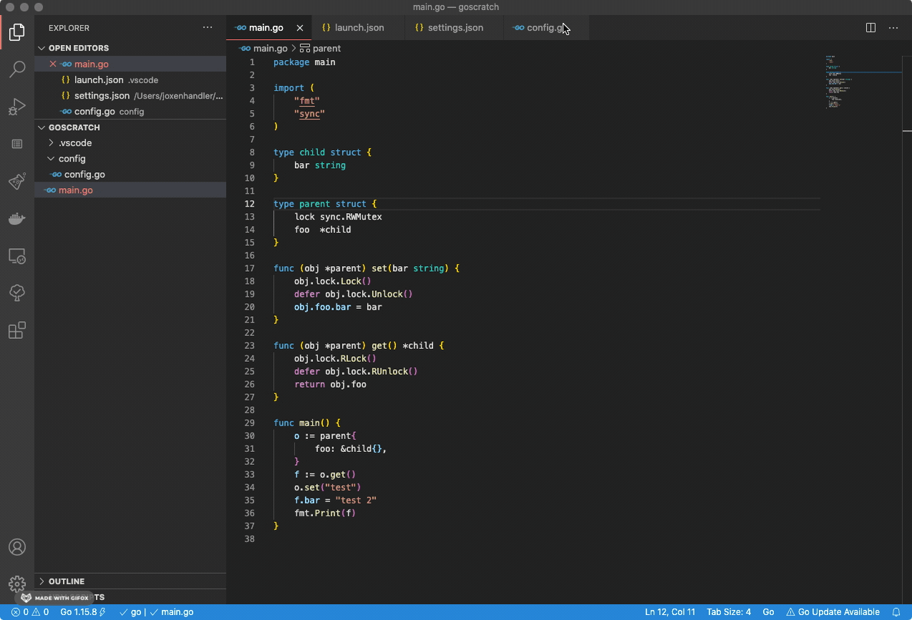

# golang-comments
Adds simple Golang comments for the function, method or type of the line the cursor is on

## Using
In a Go file, put your cursor on the line of a function, method ortype. Invoke the Go: Add Comments extension witht eh keyboard shortcu (CMD+K C on Mac) (open the command palette (CMD + Shift + P on Mac) and look for the command 'Go: Add Comments'. Hit enter.)

